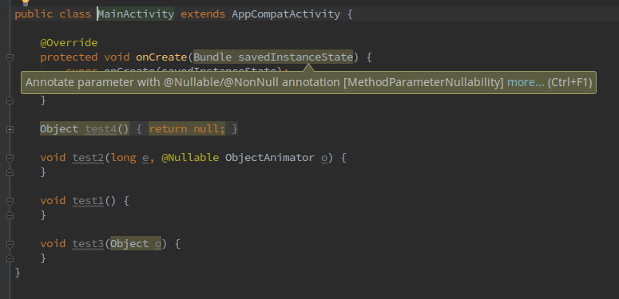

Custom nullability Lint check
=============================
Check if method parameters and method return value are annotated with nullability annotations:

 * Nullable
 * NonNull
 * NotNull
 
Note: this library does not add any methods to your result apk. It was made as aar dependency just to enable the check in Android Studio automatically.

Tested on Android Studio 2.2.2, IntelliJ IDEA 2016.2.5.
 
Download
--------
Currently available on OSS repo

```groovy
repositories {
    maven {
        url 'https://oss.sonatype.org/content/groups/public'
    }
}
```

Add library as a dependency:
```groovy
compile 'com.github.rzhukov:nullability-lint:0.1.0-SNAPSHOT'
```

Usage
-----
Nothing special. Just get this library, refresh and compile your gradle project. Then you'll be able to see something like this:  


